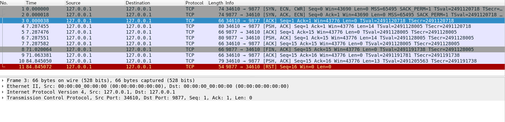

## LISTEN
 
``` sh
[moonlight@ArchLinux ~]$ netstat -a
Active Internet connections (servers and established)
Proto Recv-Q Send-Q Local Address           Foreign Address         State
tcp        0      0 0.0.0.0:9877            0.0.0.0:*               LISTEN
```


## ESTABLISHED

``` sh
[moonlight@ArchLinux ~]$ netstat -a | grep 9877
tcp        0      0 0.0.0.0:9877            0.0.0.0:*               LISTEN
tcp        0      0 localhost.localdo:33794 localhost.localdom:9877 ESTABLISHED
tcp        0      0 localhost.localdom:9877 localhost.localdo:33794 ESTABLISHED
```

## TIME\_WAIT

``` sh
[moonlight@ArchLinux ~]$ netstat -a | grep 9877
tcp        0      0 0.0.0.0:9877            0.0.0.0:*               LISTEN
tcp        0      0 localhost.localdo:33794 localhost.localdom:9877 TIME_WAIT
[moonlight@ArchLinux c5]$ ps -o pid,ppid,tty,stat,args,wchan
  PID  PPID TT       STAT COMMAND                     WCHAN
 2678  2668 pts/1    Ss   bash                        -
 2769  2678 pts/1    S    ./tcpserv01                 -
 2777  2769 pts/1    Z    [tcpserv01] <defunct>       -
 2804  2678 pts/1    R+   ps -o pid,ppid,tty,stat,arg -
```

## SIG\_CHILD

``` sh
[moonlight@ArchLinux c5]$ ./tcp5cli 127.0.0.1
child 3073 terminated
child 3074 terminated
[moonlight@ArchLinux c5]$ ps
  PID TTY          TIME CMD
 2678 pts/1    00:00:00 bash
 3071 pts/1    00:00:00 tcpserv02
 3075 pts/1    00:00:00 tcpserv02 <defunct>
 3076 pts/1    00:00:00 tcpserv02 <defunct>
 3077 pts/1    00:00:00 tcpserv02 <defunct>
 3083 pts/1    00:00:00 ps
[moonlight@ArchLinux c5]$
```
use `waitpid()`
``` sh
[moonlight@ArchLinux c5]$ ./tcpserv03 &
[1] 3119
[moonlight@ArchLinux c5]$ ./tcp5cli 127.0.0.1
child 3123 terminated
child 3124 terminated
child 3125 terminated
child 3126 terminated
child 3127 terminated
[moonlight@ArchLinux c5]$
```

## SIG\_PIPE

``` sh
[moonlight@ArchLinux c5]$ ./tcpcli 127.0.0.1
hello, server
hello, server
another line
str_cli: server terminated prematurely
[moonlight@ArchLinux c5]$ 
```
I capture the package above.

1-3: 3 times handshake
4-5: client -> server: hello, world  server: ack
6-7: server -> client: hello, world  client: ack
killing server child process ..
8 : server terminate, send `FIN`
9 : client ack
10: client try to write to a closed socket fd, and send package.
11: server refuse this package, and sent `RST`.


