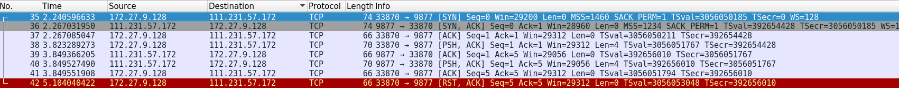
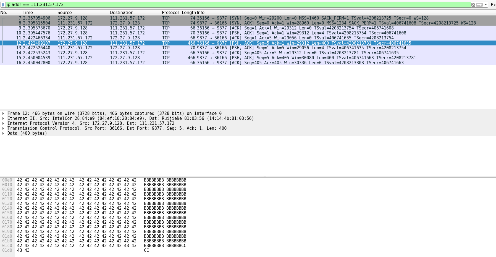

## 7.2 

[moonlight@ArchLinux ex]$ ./a.out 111.231.57.172 
recvbuf size = 87380, MSS = 536
recvbuf size = 372480, MSS = 1222
Fri Nov  9 09:55:09 2018

## 7.3

I got the RST in wireshark.

## 7.5

src for `sock` program: <http://www.icir.org/christian/sock.html>

I cann't bind loopback address after bind the 0.0.0.0 .

## 7.8 - 7.9

 

